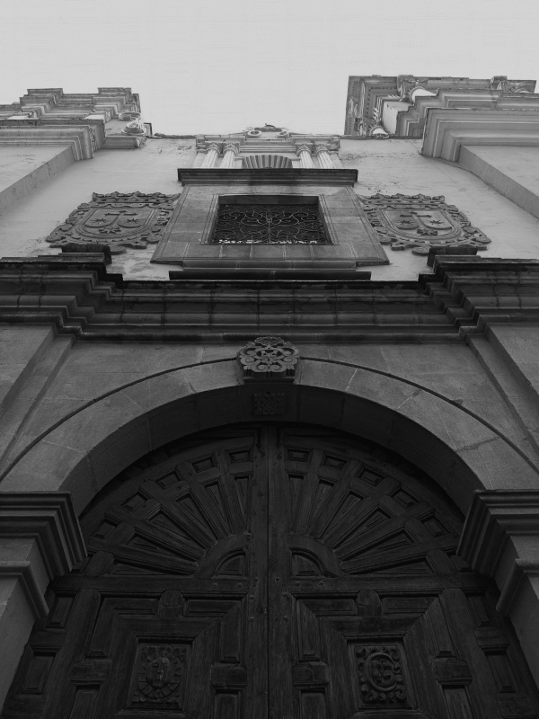

**Laura Patricia Sotelo González**
:star: ***Comunicación creativa en cultura digital*** :star:
 :smile: *Quinto trimestre* :smile:

##El siguiente repositorio alberga las prácticas artísticas que realice en la unidad de enseñanza y aprendizaje, nombrada *comunicación creativa en cultura digital*. Los siguientes ejercicios se construyen en base a una estética personal y de experimentación. Los lenguajes a utilizar son el *HTML, CSS y Javascript*. ***Cosmos de Laura***, nombre que asigne a mi repositorio, muestra los aprendizajes que he adquirido en el periodo comprendido por los meses de enero, febrero, y marzo del año en curso. **¡Bienvenidos a mi espacio!** 

###Mi relación con la tecnología web, se ha estrechado conforme avanzo en el camino de la licenciatura en **arte y comunicación digitales**. Las herramientas tecnológicas, posibilitan la solución de cuestiones tecno-estéticas, que se presentan en mi *formación universitaria*. El ciberespacio me ha concedido saberes que nutren mi proceso artístico, y permite desarrollar mis habilidades. Los sitios creados, son muestra de que mis prácticas trascienden. Algunos ejemplos son el repositorio actual, y un blog que he construido a lo largo del tiempo. [Blog personal](https://respirarolvidos.blogspot.com/) 

 

